# InstaBuild

**AI-Powered CI/CD Automation Platform for Full-Stack Applications**

InstaBuild is a Dockerized CI/CD automation platform that simplifies the build, deployment, and debugging process for modern web applications. It allows developers to deploy monorepo and multi-repository projects through configurable YAML pipelines while automatically building applications inside isolated Docker containers.

The platform integrates AI-powered log analysis to identify build failures, explain root causes, and generate debugging summaries. Deployment results, build logs, and AI insights are delivered to developers through real-time Discord notifications.

---

## Project Overview

Deploying modern applications often requires configuring multiple tools, managing Docker environments, debugging lengthy build logs, and manually deploying to different hosting platforms.

InstaBuild automates this workflow by providing a single platform that:

* Clones source code from Git repositories
* Parses deployment instructions from YAML configuration
* Creates isolated Docker build environments
* Executes CI/CD pipelines automatically
* Deploys applications to Vercel and Render
* Streams build logs in real time
* Uses AI to analyze failures and suggest fixes
* Sends deployment reports through Discord

The objective is to reduce manual deployment effort while making build failures easier to understand and resolve.

---

## Key Features

* Docker-based isolated build environment
* Monorepo and multi-repository support
* YAML-driven deployment pipelines
* Automated deployment to Vercel and Render
* AI-powered build log analysis
* Root cause detection for failed builds
* Real-time Discord notifications
* Build history and deployment metadata storage
* Secure environment variable management
* Scalable backend architecture

---

## System Workflow

```text
Developer
      │
      ▼
React Dashboard
      │
      ▼
Express Backend
      │
      ▼
Clone Git Repository
      │
      ▼
Read YAML Configuration
      │
      ▼
Create Docker Build Environment
      │
      ▼
Execute Build Pipeline
      │
      ▼
Collect Build Logs
      │
      ├──────────────► Deploy to Vercel
      │
      ├──────────────► Deploy to Render
      │
      ▼
AI Log Analysis
      │
      ▼
Generate Root Cause Summary
      │
      ▼
Discord Notification
      │
      ▼
Developer
```

---

## Architecture Overview

```mermaid
flowchart LR

A[Developer] --> B[React Dashboard]

B --> C[Express API]

C --> D[Authentication]

D --> E[Repository Manager]

E --> F[Clone Git Repository]

F --> G[Detect Repository Type]

G --> H{Repository Type}

H -->|Monorepo| I[Select Application]

H -->|Multi Repo| J[Use Repository Root]

I --> K[Read YAML Configuration]
J --> K

K --> L[Validate YAML]

L --> M[Generate Pipeline]

M --> N[Create Docker Container]

N --> O[Install Dependencies]

O --> P[Run Build Pipeline]

P --> Q[Capture Build Logs]

Q --> R[Deploy to Vercel]

Q --> S[Deploy to Render]

R --> T[Deployment URLs]
S --> T

Q --> U[AI Log Analysis]

U --> V[Clean Logs]

V --> W[Chunk Large Logs]

W --> X[LLM API]

X --> Y[Root Cause Detection]

Y --> Z[Generate Debug Report]

Z --> AA[Discord Notification]

T --> AB[Store Metadata]

AA --> AC[Developer]
AB --> AC

AB --> AD[(MongoDB)]
```



---

## Technology Stack

| Category         | Technologies             |
| ---------------- | ------------------------ |
| Frontend         | React, Vite              |
| Backend          | Node.js, Express.js      |
| Database         | MongoDB                  |
| Containerization | Docker                   |
| Infrastructure   | AWS EC2                  |
| Deployment       | Vercel, Render           |
| AI               | LLM API for Log Analysis |
| Notifications    | Discord Webhooks         |
| Configuration    | YAML                     |

---


---

## Build Lifecycle

1. Developer submits a deployment request.
2. Backend validates project configuration.
3. Repository is cloned from Git.
4. YAML pipeline is parsed.
5. Docker container is created.
6. Dependencies are installed.
7. Build and test stages are executed.
8. Build logs are streamed and stored.
9. Application is deployed to the selected platform.
10. AI analyzes logs and generates debugging insights.
11. Deployment status and URLs are stored.
12. Discord notification is sent to the developer.

---

## AI-Powered Log Analysis

Instead of requiring developers to inspect hundreds of lines of build logs manually, InstaBuild automatically analyzes execution logs using an LLM.

The AI pipeline performs:

* Build log preprocessing
* Error extraction
* Root cause identification
* Failure categorization
* Human-readable debugging summary generation
* Suggested troubleshooting steps

This significantly reduces the time required to diagnose failed deployments.

---

## Deployment Targets

The platform currently supports:

* Vercel
* Render

The deployment layer is designed to support additional providers in the future, such as AWS, Railway, Netlify, and DigitalOcean.

---

## Future Improvements

* GitHub OAuth integration
* Kubernetes-based build workers
* Parallel pipeline execution
* Build caching
* Artifact storage
* Rollback support
* Team collaboration
* Pipeline templates
* Custom deployment plugins
* Multi-cloud deployment

---
## License

This project is licensed under the MIT License.

---

## Contributors

Contributions, issues, and feature requests are welcome. Feel free to open an issue or submit a pull request to improve the project.
